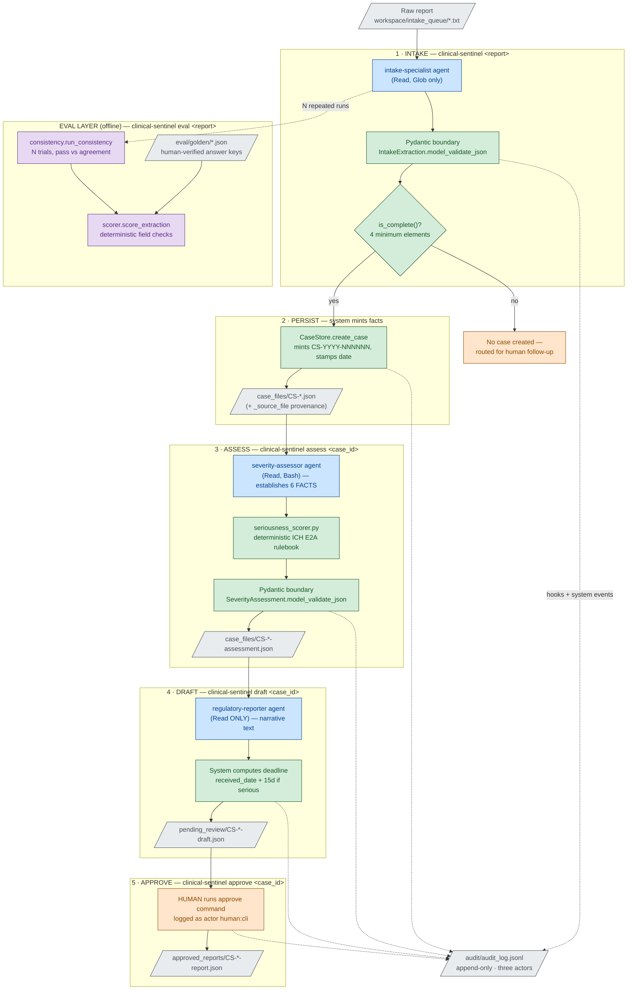
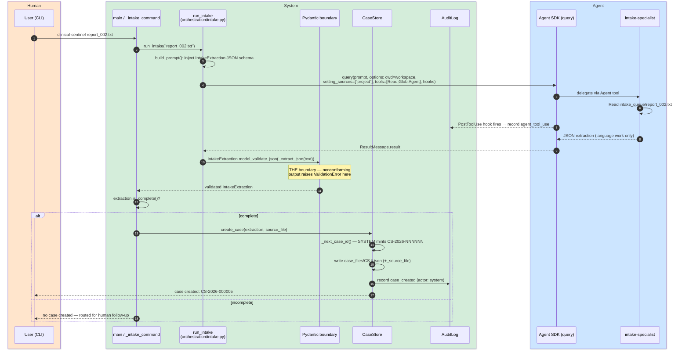
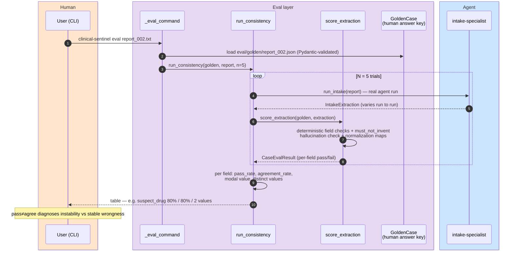

# Clinical Sentinel — Architecture & Flow Reference

*Color-coded diagrams plus a per-component reference. Reading order: the
legend, the process flow, then the sequence diagram for whichever command
you're tracing, then the component tables for the exact code behind each box.*

**Color legend (used consistently in every diagram):**

| Color | Meaning |
|---|---|
| 🔵 Blue | **Agent** — LLM work (language understanding only) |
| 🟢 Green | **System** — deterministic code (rules, IDs, math, persistence) |
| 🟠 Orange | **Human** — consequential decisions (the gate) |
| ⚪ Gray | **Data at rest** — files on disk in `workspace/` |
| 🟣 Purple | **Eval layer** — measurement of the system, outside the runtime path |

---

## 1. End-to-End Process Flow



**How to read it:** solid arrows are the runtime pipeline; dotted arrows are
audit events and the offline eval layer. Notice the color rhythm — every
blue (agent) box is immediately followed by a green (system) box: no agent
output enters the system except through a deterministic gate. The only path
to `approved_reports/` passes through orange.

---

## 2. Sequence Diagrams (per command)

### 2.1 `clinical-sentinel report_002.txt` — intake



### 2.2 `clinical-sentinel assess CS-2026-000001` — severity

```mermaid
sequenceDiagram
    autonumber
    box rgb(255,229,204) Human
        participant U as User (CLI)
    end
    box rgb(212,237,218) System
        participant M as _assess_command
        participant O as run_assessment<br/>(orchestration/severity.py)
        participant SS as seriousness_scorer.py<br/>(deterministic rulebook)
        participant B as Pydantic boundary
        participant AL as AuditLog
    end
    box rgb(204,229,255) Agent
        participant SA as severity-assessor
    end

    U->>M: clinical-sentinel assess CS-2026-000001
    M->>O: run_assessment(case_id)
    O->>SA: query(...) tools=[Read,Bash,Agent]
    SA->>SA: Read case + establish 6 boolean FACTS from text
    SA->>SS: Bash: python3 scripts/seriousness_scorer.py --death false ... --hospitalization true ...
    Note over SS: All 6 flags REQUIRED — agent must take<br/>explicit position; script owns the RULES
    SS-->>SA: {"is_serious": true, "criteria_met": ["hospitalization"]}
    Note over SA: Instructed: report script verdict verbatim,<br/>NEVER override; on script error, report error
    SA-->>O: JSON {facts, supporting_evidence, classification}
    O->>B: SeverityAssessment.model_validate_json
    B-->>M: validated SeverityAssessment
    M->>M: persist case_files/CS-*-assessment.json
    M->>AL: record assessment_recorded (actor: system)
    M-->>U: serious: True · criteria: [hospitalization]
```

### 2.3 `draft` + `approve` — the human gate

```mermaid
sequenceDiagram
    autonumber
    box rgb(255,229,204) Human
        participant U as User (CLI)
    end
    box rgb(212,237,218) System
        participant D as run_draft<br/>(orchestration/reporting.py)
        participant AL as AuditLog
        participant A as _approve_command
    end
    box rgb(204,229,255) Agent
        participant RA as regulatory-reporter<br/>(Read ONLY)
    end

    U->>D: clinical-sentinel draft CS-2026-000001
    D->>D: fail fast: assessment file must exist
    D->>RA: query(...) tools=[Read,Agent] — read-only by design
    RA-->>D: JSON {narrative} — language work ONLY
    D->>D: SYSTEM computes: is_expedited = script verdict;<br/>deadline = received_date + 15 days
    D->>D: write pending_review/CS-*-draft.json (status: pending_review)
    D->>AL: record report_drafted (actor: system:reporting)
    D-->>U: PENDING HUMAN REVIEW — use 'approve' after reading

    Note over U: Human reads the draft. Nothing proceeds without this.

    U->>A: clinical-sentinel approve CS-2026-000001
    A->>A: move to approved_reports/, status → approved,<br/>delete pending copy (can't be both)
    A->>AL: record report_approved (actor: human:cli)
    A-->>U: approved — recorded with actor 'human:cli'
```

### 2.4 `eval` — the measurement layer



---

## 3. Component Reference

*One table per layer. "Depends on" lists project classes/modules only.*

### 3.1 Entry point & configuration (🟢 system)

| Component | Code | Responsibility | Inputs | Outputs | Depends on |
|---|---|---|---|---|---|
| CLI dispatch | `src/clinical_sentinel/__init__.py` · `main()` | Parse argv, route to exactly one command handler; usage + exit 2 on anything else | `sys.argv` | Calls one `_*_command` | all command handlers |
| Intake command | `__init__.py` · `_intake_command()` | Run intake, display scorecard, persist if complete | report filename | stdout; case file via CaseStore | `run_intake`, `CaseStore`, `AuditLog`, `get_settings` |
| Assess command | `__init__.py` · `_assess_command()` | Run assessment, display, persist assessment JSON, audit | case_id | `case_files/*-assessment.json` | `run_assessment`, `AuditLog` |
| Draft / Approve / Eval commands | `__init__.py` | Thin wrappers over orchestrators + the human gate | case_id / report | files + stdout | `run_draft`, `run_consistency` |
| Settings | `config.py` · `Settings` (frozen dataclass) | Single source of truth: model name, workspace path, derived dir properties (`audit_dir`, `case_files_dir`, `intake_queue_dir`) | env via `load_dotenv()` | immutable `Settings` | — |
| Fail-fast gate | `config.py` · `get_settings()` | Reject missing `ANTHROPIC_API_KEY` at startup with a fix-it message; secret never stored on the object | env | `Settings` or `RuntimeError` | `Settings` |

### 3.2 Domain models (🟢 system — the executable regulations)

| Component | Code | Responsibility | Inputs | Outputs | Depends on |
|---|---|---|---|---|---|
| `Seriousness` | `models/case.py` (StrEnum) | The 6 ICH E2A criteria as a closed vocabulary; serializes as plain strings | — | enum values | — |
| `Patient` | `models/case.py` | Optional identifiers + `is_identifiable()` (any one of age/sex/initials suffices); age constrained 0–130 | field values | validated Patient | — |
| `AdverseEventCase` | `models/case.py` | THE case. Regex-enforced `case_id`, min-length fields, and `@model_validator patient_must_be_identifiable` — an invalid case is **unconstructible** | field values | validated case or `ValidationError` | `Patient`, `Seriousness` |
| `IntakeExtraction` | `models/intake.py` | What the intake agent RETURNS. Deliberately has NO case_id/date (Principle: LLMs never mint system facts). Carries `supporting_quotes` (traceability) and `missing_elements` (gaps as data). `is_complete()` = 4 elements present | agent JSON | validated extraction | `Patient` |
| `SeriousnessFacts` / `Classification` / `SeverityAssessment` | `models/severity.py` | Facts (agent's 6 booleans) kept structurally separate from verdict (script's output); `criteria_met` typed as `list[Seriousness]` so vocab drift dies at validation | agent JSON | validated assessment | `Seriousness` |
| `ReportNarrative` / `RegulatoryDraft` | `models/report.py` | Narrative = the ONLY agent contribution; draft adds system facts (expedited flag, computed deadline, status lifecycle) | agent JSON + system facts | validated draft | — |

### 3.3 Orchestration (🟢 system wrapping 🔵 agents)

| Component | Code | Responsibility | Inputs | Outputs | Depends on |
|---|---|---|---|---|---|
| `run_intake` | `orchestration/intake.py` | Build prompt with injected `IntakeExtraction.model_json_schema()` (contract = validator, cannot drift); run SDK `query` with `cwd=workspace`, `setting_sources=["project"]`, least-privilege tools, audit hooks; validate result at the boundary | report filename | `IntakeExtraction` | SDK, `IntakeExtraction`, `AuditLog`, `Settings` |
| `_make_tool_audit_hook` | `orchestration/intake.py` | Closure-built `PostToolUse` hook: runtime records every matching tool call (path only, never contents) — agent cannot skip it | hook input | audit line; `{}` (observe-only) | `AuditLog` |
| `run_assessment` | `orchestration/severity.py` | Same pattern, tools add `Bash` (rulebook script), matcher adds `Bash` to audited tools | case_id | `SeverityAssessment` | SDK, `SeverityAssessment`, `AuditLog` |
| `run_draft` | `orchestration/reporting.py` | Fail fast if assessment missing; read-only agent; SYSTEM computes `is_expedited` + `deadline = received + 15d`; persist to `pending_review/`; audit | case_id | `RegulatoryDraft` + pending file | SDK, `RegulatoryDraft`, `SeverityAssessment`, `AuditLog` |

### 3.4 Workspace (🔵 agents + ⚪ data — the SDK's world)

| Component | Location | Responsibility | Tools granted |
|---|---|---|---|
| Agent constitution | `workspace/CLAUDE.md` | Shared context: product catalog, the 4-element rule, "absent data stays absent," "you do NOT make regulatory submissions" | — |
| intake-specialist | `workspace/.claude/agents/intake-specialist.md` | Extract one report → JSON; verbatim capture; incomplete is a VALID outcome | `Read, Glob` |
| severity-assessor | `.claude/agents/severity-assessor.md` | Establish 6 FACTS with evidence; run the script; never override its verdict | `Read, Bash` |
| regulatory-reporter | `.claude/agents/regulatory-reporter.md` | Draft narrative only; read-only by design; never imply submission | `Read` |
| Rulebook script | `workspace/scripts/seriousness_scorer.py` | ICH E2A as stdlib-only code: 6 required boolean flags → `{is_serious, criteria_met}`; vocabulary matches the `Seriousness` enum | run via agent Bash |
| Data directories | `intake_queue/` → `case_files/` → `pending_review/` → `approved_reports/`; `audit/` | The physical workflow; audit is append-only JSONL written only by `AuditLog` | — |

### 3.5 Persistence (🟢 system)

| Component | Code | Responsibility | Inputs | Outputs | Depends on |
|---|---|---|---|---|---|
| `CaseStore` | `persistence/case_store.py` | Promote a COMPLETE extraction to a persisted case. `_next_case_id()` mints `CS-YYYY-NNNNNN` (system fact); `or ""` guards make incomplete extractions fail the domain model's min-length constraints — layers defend each other. Writes `_source_file` provenance. Audit via injected `AuditLog` (dependency injection; optional for tests) | `IntakeExtraction`, source filename | `AdverseEventCase` + JSON file | `AdverseEventCase`, `IntakeExtraction`, `AuditLog` |
| `AuditLog` | `persistence/audit.py` | Append-only JSONL: UTC timestamp, event_type, **actor** (`agent:*` / `system:*` / `human:*`), detail. No read/update/delete API — by design | event fields | one JSONL line | — |

### 3.6 Eval layer (🟣 measurement — outside the runtime path)

| Component | Code | Responsibility | Inputs | Outputs | Depends on |
|---|---|---|---|---|---|
| `GoldenCase` (+`GoldenExpected`, `GoldenPatient`) | `evals/models.py` | Parse human-verified answer keys; `must_not_invent` encodes what a correct system *refrains* from doing; malformed labels die at load | `eval/golden/*.json` | validated golden | — |
| `score_extraction` | `evals/scorer.py` | Deterministic per-field comparison; normalization rulings live HERE as code (reporter category map, initials punctuation); hallucination check: golden-null + system-value = `is_hallucination` | `GoldenCase`, `IntakeExtraction` | `CaseEvalResult` (per-field scorecard) | eval models, `IntakeExtraction` |
| `run_consistency` | `evals/consistency.py` | Same report N times (real agent runs — cost note in docstring); per field: `pass_rate` (correctness) vs `agreement_rate` (stability) + modal value + distinct count. The 2×2 of the two rates diagnoses content vs constraint fixes | golden, report, N | `ConsistencyReport` | scorer, `run_intake` |
| `FieldResult` / `CaseEvalResult` / `FieldConsistency` / `ConsistencyReport` | `evals/models.py`, `consistency.py` | Scorecards, not gates: evals are an instrument panel; a deployment gate is a threshold applied on top | — | typed results | — |

### 3.7 Tests (🟢 deterministic layer QA)

| Component | Code | Covers |
|---|---|---|
| Domain model suite | `tests/test_case_model.py` | 6 assertions: valid construction, default non-serious, seriousness flags, malformed ID rejection, unidentifiable-patient rejection, single-qualifier identifiability. Deterministic tests for deterministic code; the eval layer covers the probabilistic components — same boundary as the architecture itself |

---

## 4. Tracing One Case, Start to Finish

`report_001.txt` (Dr. Patel's call transcript) through every layer:

1. **⚪→🔵** `intake_queue/report_001.txt` read by intake-specialist (hook logs the Read).
2. **🔵→🟢** Agent JSON hits `IntakeExtraction.model_validate_json` — validated: 62/male, Drugamab, breathing event, 3 supporting quotes, complete.
3. **🟢→⚪** `CaseStore` mints `CS-2026-000001`, stamps date, writes `case_files/CS-2026-000001.json` with `_source_file: report_001.txt`; audit: `case_created / system`.
4. **⚪→🔵→🟢** Assessor reads case, establishes facts (hospitalization: true — "admit him overnight"), runs `seriousness_scorer.py`; script returns `{is_serious: true, criteria_met: [hospitalization]}`; validated as `SeverityAssessment`; persisted; audit: `assessment_recorded / system`.
5. **⚪→🔵→🟢→⚪** Reporter (read-only) drafts narrative; system computes `is_expedited: true`, `deadline: 2026-07-31` (received 07-16 + 15d); draft lands in `pending_review/`; audit: `report_drafted / system:reporting`.
6. **🟠→⚪** Human reads the draft, runs `approve`; file moves to `approved_reports/` with status `approved`; pending copy deleted; audit: `report_approved / human:cli`.
7. **🟣 (offline)** `eval report_001.txt` runs the intake agent N times against the human-verified golden label, reporting per-field pass and agreement rates.

Final audit trail for this one case reads, in order: agent read → system created →
agent read ×2 → system recorded → system drafted → **human approved** — three
actors, one append-only timeline, every step timestamped in UTC.