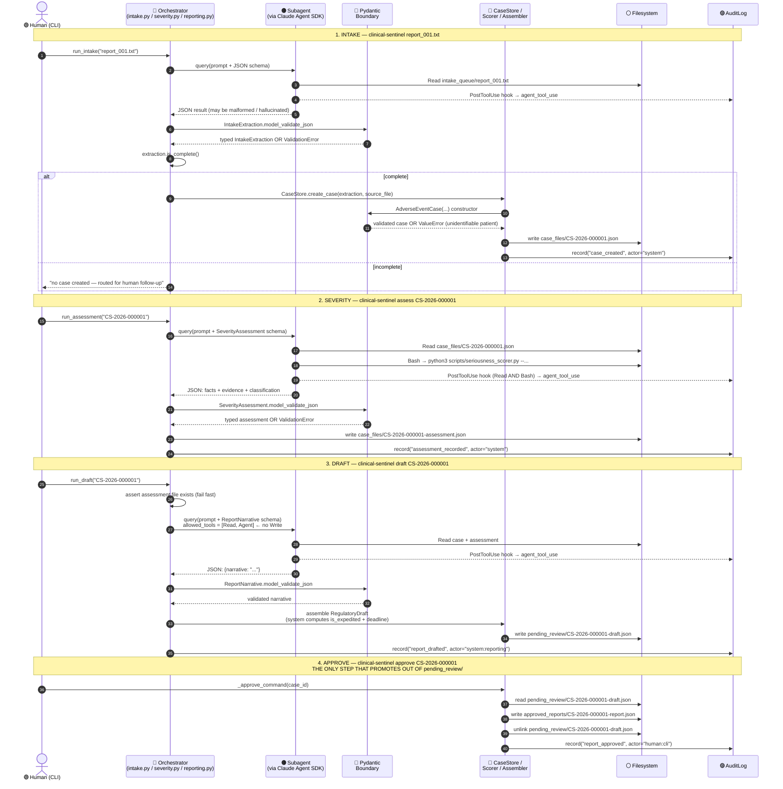
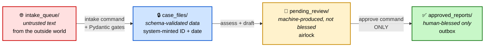

# Clinical Sentinel — Process Flow

A visual, code-grounded walk through what actually happens when a report
enters the system and moves toward an approved regulatory draft.

Every step below cites the exact file and line that implements it, so
this document stays honest to the code — not aspirational.

---

## Legend

Four actor types move data through the system. The color of a node
tells you *who* is doing the work, which is the same as *what kind of
guarantee* you get.

| Color        | Actor       | Meaning                                                                                | Guarantee                          |
|--------------|-------------|----------------------------------------------------------------------------------------|------------------------------------|
| 🟠 Amber     | `agent:*`   | LLM subagent (intake / severity / reporter)                                            | Best-effort, non-deterministic     |
| 🔵 Blue      | `system`    | Deterministic Python code (orchestrator, persistence, hooks)                           | Same input → same output, always   |
| 🟢 Green     | `human:cli` | You, at the terminal                                                                   | The only actor that ships anything |
| ⚪ Gray      | *storage*   | Files on disk (`intake_queue/`, `case_files/`, `pending_review/`, `approved_reports/`) | State — no logic                   |
| 🔴 Red edge  | *validator* | Pydantic schema boundary — rejects malformed output                                    | Malformed data cannot pass         |

---

## High-level flow

Four CLI commands, chained by files on disk. Each command is a discrete
run — the system has no long-lived daemon. State lives in the folders,
not in memory.

```mermaid
flowchart LR
    subgraph INBOX["📥 intake_queue/"]
        RAW["report_XXX.txt<br/>(raw transcript / email)"]
    end

    subgraph INTAKE["clinical-sentinel &lt;file&gt;"]
        IA["intake-specialist agent<br/>Read, Glob"]
        IV{{"IntakeExtraction<br/>Pydantic validate"}}
        CS["CaseStore.create_case<br/>mints ID + date"]
        CV{{"AdverseEventCase<br/>patient_must_be_identifiable"}}
    end

    subgraph CASES["📁 case_files/"]
        CJ["CS-YYYY-NNNNNN.json"]
        AJ["CS-YYYY-NNNNNN-assessment.json"]
    end

    subgraph ASSESS["clinical-sentinel assess &lt;id&gt;"]
        SA["severity-assessor agent<br/>Read, Bash"]
        SCRIPT["seriousness_scorer.py<br/>(deterministic rulebook)"]
        SV{{"SeverityAssessment<br/>Pydantic validate"}}
    end

    subgraph DRAFT["clinical-sentinel draft &lt;id&gt;"]
        RA["regulatory-reporter agent<br/>Read only"]
        RV{{"ReportNarrative<br/>Pydantic validate"}}
        RD["RegulatoryDraft assembled<br/>system computes deadline"]
    end

    subgraph PENDING["📁 pending_review/"]
        PD["CS-YYYY-NNNNNN-draft.json"]
    end

    subgraph APPROVE["clinical-sentinel approve &lt;id&gt;"]
        HG["THE HUMAN GATE<br/>only move to approved/"]
    end

    subgraph APPROVED["📁 approved_reports/"]
        AR["CS-YYYY-NNNNNN-report.json"]
    end

    AUDIT[("📜 audit/audit_log.jsonl<br/>append-only")]

    RAW --> IA --> IV -.->|"invalid → raise"| X1[/"❌ Rejected"/]
    IV --> CS --> CV -.->|"unidentifiable → raise"| X2[/"❌ Rejected"/]
    CV --> CJ
    CJ --> SA --> SCRIPT --> SV --> AJ
    CJ --> RA
    AJ --> RA
    RA --> RV --> RD --> PD
    PD --> HG --> AR

    IA -.->|"PostToolUse hook"| AUDIT
    SA -.->|"PostToolUse hook"| AUDIT
    RA -.->|"PostToolUse hook"| AUDIT
    CS -.->|"case_created"| AUDIT
    RD -.->|"report_drafted"| AUDIT
    HG -.->|"report_approved"| AUDIT

    classDef agent   fill:#ffd699,stroke:#c76b00,stroke-width:2px,color:#000
    classDef system  fill:#cfe4ff,stroke:#0b57d0,stroke-width:2px,color:#000
    classDef human   fill:#c8f7c8,stroke:#1a7a1a,stroke-width:2px,color:#000
    classDef storage fill:#eeeeee,stroke:#666666,stroke-width:1px,color:#000
    classDef valid   fill:#fff,stroke:#c00,stroke-width:2px,color:#000
    classDef audit   fill:#f4e3ff,stroke:#6b21a8,stroke-width:2px,color:#000
    classDef reject  fill:#ffe0e0,stroke:#c00,stroke-width:1px,color:#000

    class IA,SA,RA agent
    class CS,SCRIPT,RD system
    class HG human
    class RAW,CJ,AJ,PD,AR storage
    class IV,CV,SV,RV valid
    class AUDIT audit
    class X1,X2 reject
```



---

## Sequence: one report, end-to-end

This traces the actual demo case (`report_001.txt` → `CS-2026-000001`).
Time flows top to bottom. Note who owns each arrow.



---

## Step-by-step, grounded in code

Each row = one runtime step. `File:Lines` points at the exact code that
executes it. Read this alongside the sequence diagram above.

### Stage 1 — Intake

| # | Actor | Step | Code |
|---|-------|------|------|
| 1.1 | 🟢 human | Invoke CLI: `clinical-sentinel report_001.txt` | `src/clinical_sentinel/__init__.py:125` |
| 1.2 | 🔵 system | Dispatch to `_intake_command` | `src/clinical_sentinel/__init__.py:21-45` |
| 1.3 | 🔵 system | Build prompt with injected Pydantic schema | `src/clinical_sentinel/orchestration/intake.py:17-30` |
| 1.4 | 🔵 system | Configure SDK: `cwd=workspace`, `allowed_tools=[Read, Glob, Agent]`, install `PostToolUse` hook | `src/clinical_sentinel/orchestration/intake.py:74-88` |
| 1.5 | 🟠 agent | `intake-specialist` reads the raw report | `workspace/.claude/agents/intake-specialist.md` |
| 1.6 | 🔵 system | Every tool use → audit hook fires (deterministic, unskippable) | `src/clinical_sentinel/orchestration/intake.py:42-63` |
| 1.7 | 🔴 validator | `IntakeExtraction.model_validate_json(...)` — the boundary | `src/clinical_sentinel/orchestration/intake.py:101` |
| 1.8 | 🔵 system | `extraction.is_complete()` — 4 minimum elements check | `src/clinical_sentinel/models/intake.py:34-40` |
| 1.9 | 🔵 system | `CaseStore.create_case` mints ID + received_date | `src/clinical_sentinel/persistence/case_store.py:35-49` |
| 1.10 | 🔴 validator | `AdverseEventCase(...)` runs `patient_must_be_identifiable` | `src/clinical_sentinel/models/case.py:72-87` |
| 1.11 | ⚪ storage | Write `case_files/CS-YYYY-NNNNNN.json` (+ `_source_file` provenance) | `src/clinical_sentinel/persistence/case_store.py:51-54` |
| 1.12 | 🟣 audit | `record("case_created", actor="system", ...)` | `src/clinical_sentinel/persistence/case_store.py:55-60` |

### Stage 2 — Severity

| # | Actor | Step | Code |
|---|-------|------|------|
| 2.1 | 🟢 human | `clinical-sentinel assess CS-2026-000001` | `src/clinical_sentinel/__init__.py:112-114` |
| 2.2 | 🔵 system | Dispatch to `_assess_command` | `src/clinical_sentinel/__init__.py:48-66` |
| 2.3 | 🔵 system | Configure SDK: `allowed_tools=[Read, Bash, Agent]`, hook matcher = `Read\|Glob\|Bash` | `src/clinical_sentinel/orchestration/severity.py:34-46` |
| 2.4 | 🟠 agent | `severity-assessor` reads case, establishes 6 facts + evidence quotes | `workspace/.claude/agents/severity-assessor.md` |
| 2.5 | 🟠 agent | Runs the rulebook: `python3 scripts/seriousness_scorer.py --death false --hospitalization true ...` | `workspace/scripts/seriousness_scorer.py:26-52` |
| 2.6 | 🔵 system | Bash execution audited by same hook | `src/clinical_sentinel/orchestration/intake.py:42-63` (reused) |
| 2.7 | 🔴 validator | `SeverityAssessment.model_validate_json(...)` | `src/clinical_sentinel/orchestration/severity.py:56` |
| 2.8 | ⚪ storage | Write `case_files/CS-YYYY-NNNNNN-assessment.json` | `src/clinical_sentinel/__init__.py:59-60` |
| 2.9 | 🟣 audit | `record("assessment_recorded", actor="system", ...)` | `src/clinical_sentinel/__init__.py:61-65` |

### Stage 3 — Draft

| # | Actor | Step | Code |
|---|-------|------|------|
| 3.1 | 🟢 human | `clinical-sentinel draft CS-2026-000001` | `src/clinical_sentinel/__init__.py:116-118` |
| 3.2 | 🔵 system | Fail-fast: assessment file must exist before spending an agent run | `src/clinical_sentinel/orchestration/reporting.py:38-43` |
| 3.3 | 🔵 system | Configure SDK: `allowed_tools=[Read, Agent]` — **NO Write, NO Bash** | `src/clinical_sentinel/orchestration/reporting.py:47-57` |
| 3.4 | 🟠 agent | `regulatory-reporter` reads case + assessment, drafts narrative | `workspace/.claude/agents/regulatory-reporter.md` |
| 3.5 | 🔴 validator | `ReportNarrative.model_validate_json(...)` | `src/clinical_sentinel/orchestration/reporting.py:66` |
| 3.6 | 🔵 system | Compute `is_expedited` from classification, `reporting_deadline = received + 15 days` | `src/clinical_sentinel/orchestration/reporting.py:70-78` |
| 3.7 | ⚪ storage | Write `pending_review/CS-YYYY-NNNNNN-draft.json` — **this folder is the airlock** | `src/clinical_sentinel/orchestration/reporting.py:80-82` |
| 3.8 | 🟣 audit | `record("report_drafted", actor="system:reporting", ...)` | `src/clinical_sentinel/orchestration/reporting.py:83-88` |

### Stage 4 — Approve (the human gate)

| # | Actor | Step | Code |
|---|-------|------|------|
| 4.1 | 🟢 human | `clinical-sentinel approve CS-2026-000001` — the only path out of `pending_review/` | `src/clinical_sentinel/__init__.py:120-122` |
| 4.2 | 🔵 system | Verify pending draft exists; else exit code 1 | `src/clinical_sentinel/__init__.py:83-87` |
| 4.3 | 🔵 system | Flip `status` → `"approved"`, write to `approved_reports/`, delete from `pending_review/` | `src/clinical_sentinel/__init__.py:89-94` |
| 4.4 | 🟣 audit | `record("report_approved", actor="human:cli", ...)` — the third actor type appears | `src/clinical_sentinel/__init__.py:96-100` |

---

## Trust zones (folder progression)

Every case file lives in exactly one folder at a time. The folder *is*
the trust level. There is no code path that skips a zone.



---

## Where the boundaries are

Four Pydantic gates. Every LLM output crosses one of them before any
system code trusts it as data.

| Gate | Model                     | Location                                                     | What it enforces                                     |
|------|---------------------------|--------------------------------------------------------------|------------------------------------------------------|
| G1   | `IntakeExtraction`        | `src/clinical_sentinel/orchestration/intake.py:101`          | Types & shapes on the raw agent extraction           |
| G2   | `AdverseEventCase`        | `src/clinical_sentinel/persistence/case_store.py:42-49`      | 4 minimum elements + `patient_must_be_identifiable`  |
| G3   | `SeverityAssessment`      | `src/clinical_sentinel/orchestration/severity.py:56`         | 6 facts + evidence dict + classification block       |
| G4   | `ReportNarrative`         | `src/clinical_sentinel/orchestration/reporting.py:66`        | Non-empty narrative string only                      |

**What the gates cannot catch** — a well-formed hallucination inside a
valid schema (e.g., an invented `age_years: 70` on a source that had no
age). Structured outputs enforce shape, not truth. That is a known gap;
`supporting_quotes` exists on `IntakeExtraction` for post-hoc auditing
but is not cross-checked at runtime.

---

## Audit as the through-line

Only one file grows across all stages: `workspace/audit/audit_log.jsonl`.
Append-only by construction — there is no update or delete API.

| Event                   | Actor                      | Emitted by                                                             |
|-------------------------|----------------------------|------------------------------------------------------------------------|
| `agent_tool_use`        | `agent:intake-specialist`  | `src/clinical_sentinel/orchestration/intake.py:50-61` (PostToolUse)    |
| `case_created`          | `system`                   | `src/clinical_sentinel/persistence/case_store.py:56-60`                |
| `assessment_recorded`   | `system`                   | `src/clinical_sentinel/__init__.py:61-65`                              |
| `report_drafted`        | `system:reporting`         | `src/clinical_sentinel/orchestration/reporting.py:83-88`               |
| `report_approved`       | `human:cli`                | `src/clinical_sentinel/__init__.py:96-100`                             |

Three actor namespaces total — `agent:*`, `system`, `human:cli` — and
every consequential state change carries the name of the one that did it.

---

## Reproducing the flow

```bash
uv run clinical-sentinel report_001.txt
uv run clinical-sentinel assess    CS-2026-000001
uv run clinical-sentinel draft     CS-2026-000001
uv run clinical-sentinel approve   CS-2026-000001
```

After all four commands:

- `workspace/case_files/CS-2026-000001.json` — validated case
- `workspace/case_files/CS-2026-000001-assessment.json` — severity verdict
- `workspace/approved_reports/CS-2026-000001-report.json` — human-blessed draft
- `workspace/pending_review/` — empty (the draft was promoted, not copied)
- `workspace/audit/audit_log.jsonl` — grows with events from all three actor types
